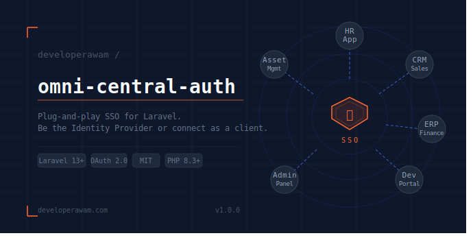

# Omni Central Auth

**A plug-and-play SSO solution for Laravel — be the Identity Provider or connect as a client.**

[](https://github.com/restu-lomboe/omni-central-auth/releases)
[](https://github.com/restu-lomboe/omni-central-auth/actions/workflows/tests.yml)
[](https://packagist.org/packages/developerawam/omni-central-auth)
[](LICENSE.md)
[](https://php.net)
[](https://laravel.com)

---

## 

## About

`omni-central-auth` is a Laravel package that lets you build your own **Single Sign-On (SSO)** system — either as:

- **Identity Provider (SSO Server)** — one central login for all your applications
- **Service Provider (Client App)** — an application that delegates authentication to the SSO Server

Built on top of **Laravel Passport** (OAuth2), **Laravel Fortify** (Auth UI), and **Laravel Socialite** (OAuth2 Client).

**Data Push Architecture:** Unlike standard OAuth2 where the client must exchange an authorization code and fetch user data via API, Omni Central Auth uses **encrypted payload push** — after authorization, the SSO Server directly pushes user data to the client's callback URI using AES-256-CBC encryption with a shared signing key. This eliminates two round-trips and simplifies the client integration.

---

## Requirements

- PHP 8.2+
- Laravel 13+
- Livewire 4+
- TailwindCSS v4+ (CDN via `@tailwindcss/browser`)
- ext-sodium (required by Laravel Passport for JWT signing)

> **Windows / XAMPP users:** Enable sodium in `php.ini` by uncommenting `;extension=sodium` → `extension=sodium`, then restart Apache.

---

## Installation

```bash
composer require developerawam/omni-central-auth
```

Run the interactive install command:

```bash
php artisan omni:install
```

The installer will guide you through the following steps:

1. **Choose a mode** — `server` or `client`
2. **Publish config** — `config/omni-central-auth.php`
3. **Publish migrations** — copied to `database/migrations/`
4. **Run migrations** — creates all required tables
5. **Passport setup** _(server mode only)_ — generates encryption keys and creates:
   - Personal Access Client
   - SSO Client for client apps
6. **Signing key generation** _(server mode only)_ — `OMNI_CENTRAL_SIGNING_KEY` auto-generated
7. **`.env` updated** — `OMNI_AUTH_MODE` is set automatically

---

## Mode: `server` (Identity Provider)

### 1. Add traits to your User model

```php
use Laravel\Passport\HasApiTokens;
use Laravel\Fortify\TwoFactorAuthenticatable;

class User extends Authenticatable
{
    use HasApiTokens, TwoFactorAuthenticatable;

    protected $fillable = [
        'name',
        'email',
        'password',
        'role',      // required by omni-central-auth
        'is_admin',  // required by omni-central-auth
    ];
}
```

### 2. Set mode in `.env`

```env
OMNI_AUTH_MODE=server
```

### 3. Run migrations

```bash
php artisan migrate
```

### 4. Register

Open `/register` and create your first account. The **first registered user is automatically set as admin**.

### 5. Open the Admin Dashboard

```
http://your-app.com/omni-dashboard
```

### 6. Create an OAuth Client for each client app

Go to `/omni-dashboard/clients/create` and fill in:

- **App Name** — e.g. `HR Application`
- **Redirect URI** — the callback URL on the client app, e.g. `http://client-app.com/omni/callback`

> Do **not** use Client ID `1` or `2` — those are created automatically by Passport for internal use and do not support Authorization Code flow.

After creating, copy the **Client ID**, **Client Secret**, and **SSO Signing Key** — you will need them in the client app.

> The **SSO Signing Key** (`OMNI_CENTRAL_SIGNING_KEY`) is auto-generated during `php artisan omni:install` and saved to `.env`. It is used to encrypt user data payloads sent to client apps. Client apps must use the **exact same key** to decrypt.

---

## Mode: `client` (Service Provider)

### 1. Install the package

```bash
composer require developerawam/omni-central-auth
php artisan omni:install
# Choose: client
```

### 2. Publish and run migrations

```bash
php artisan vendor:publish --tag=omni-migrations
php artisan migrate
```

### 3. Disable Fortify views

Since the client app does not handle login UI itself, publish the Fortify config and disable its views:

```bash
php artisan vendor:publish --provider="Laravel\Fortify\FortifyServiceProvider"
```

In `config/fortify.php`:

```php
'views' => false,
```

### 4. Socialite driver (automatic)

The package automatically registers the `omni` Socialite OAuth2 driver from your `.env` configuration. No manual setup in `config/services.php` is required — the `ClientMode` bootstrapper reads credentials directly from `config('omni-central-auth.client.*')`.

> The Socialite driver is only used for the **redirect** step to the SSO Server. The callback no longer uses Socialite — user data is received via encrypted payload.

### 5. Set credentials in `.env`

```env
OMNI_AUTH_MODE=client
OMNI_CLIENT_SERVER_URL=http://your-sso-server.com
OMNI_CLIENT_ID=3
OMNI_CLIENT_SECRET=your-client-secret
OMNI_CLIENT_REDIRECT_URI=http://your-client-app.com/omni/callback
OMNI_CENTRAL_SIGNING_KEY=copy-from-server
```

> `OMNI_CLIENT_REDIRECT_URI` must be a **full URL** and must match exactly what is registered in the SSO server dashboard.
> `OMNI_CENTRAL_SIGNING_KEY` must be **identical** on both server and client — it is used to encrypt (server) and decrypt (client) the user data payload.

### 6. Add the login button to your view

The package includes a ready-to-use SSO login button that opens a **popup window** (similar to Google SSO):

```blade
@include('omni::components.login-button')
```

The popup flow:

1. Clicking the button opens a centered popup to the SSO Server
2. User logs in and authorizes in the popup
3. On success, the popup closes automatically via `postMessage`
4. The parent page reloads with the user logged in

For a direct redirect (no popup), use the route manually:

```blade
<a href="{{ route('omni.login') }}">Login with Central Account</a>
```

> **No-JavaScript fallback:** The login button component includes a `<noscript>` fallback that uses a regular redirect.

### 7. Customize redirect after login

In `.env`:

```env
OMNI_CLIENT_HOME=/dashboard
```

---

## SSO Flow

### Popup Login (Default)

The login button opens a **popup window** (similar to Google SSO). After authorization, the server directly sends user data to the parent window via `postMessage` — no redirect back to client callback:

```
[Client App]                  [Popup Window]              [SSO Server]
     │                              │                         │
     │  Click "Login"               │                         │
     │──opens popup────────────────▶│                         │
     │                              │──GET /omni/login───────▶│
     │                              │  (Socialite redirect)   │
     │                              │◀────/oauth/authorize────│
     │                              │                         │
     │                              │  User logs in           │
     │                              │  User sees consent      │
     │                              │  Clicks Authorize       │
     │                              │────────POST /approve───▶│
     │                              │                         │
     │                              │  Encrypt user data      │
     │                              │◀───approved view────────│
     │                              │  postMessage(sso_data)  │
     │◀──popup closes──────────────│                         │
     │                              │                         │
     │  fetch POST /callback/ajax   │                         │
     │  Decrypt + login user        │                         │
     │  window.location.reload()    │                         │
     ▼                                                       ▼
User logged in
```

### Direct Push Architecture

Unlike standard OAuth2 (which requires the client to exchange an authorization code for a token, then fetch user data via API), Omni Central Auth uses **encrypted payload push**:

```
[Client App]
     │
     │  Click "Login" button
     ▼
Open popup → GET /omni/login → redirect to SSO Server
     │
[SSO Server] User logs in & authorizes
     │
     │  Encrypt user data: { omni_id, name, email, avatar, timestamp }
     │  Return approved view with postMessage
     ▼
[Popup] postMessage({sso_data: ENCRYPTED}) → parent window → popup close
     │
[Client App] Parent receives postMessage
     │
     │  fetch POST /omni/callback/ajax with sso_data
     ▼
[Client App] Decrypt payload → firstOrCreate user → auth()->login()
     │
     │  window.location.reload()
     ▼
User logged in
```

### Benefits over Standard OAuth2

| Aspect                          | Standard OAuth2                            | Omni Direct Push              |
| ------------------------------- | ------------------------------------------ | ----------------------------- |
| Round-trips after redirect      | 3 (exchange code → get token → fetch user) | 0 (data included in redirect) |
| API endpoint required on server | `/api/user`                                | None (optional)               |
| Access token management         | Required (token storage, refresh)          | None                          |
| Works without `/api/user`       | No                                         | Yes                           |
| Security                        | OAuth2 state + authorization code          | AES-256-CBC encrypted payload |

---

## Admin Dashboard

Available at `/omni-dashboard` (configurable via `config/omni-central-auth.php`).

| Feature           | Description                                                    |
| ----------------- | -------------------------------------------------------------- |
| **OAuth Clients** | Register and manage applications allowed to connect to the SSO |
| **Users & Roles** | Manage users and their access roles                            |
| **Audit Log**     | Monitor login, logout, and token activity                      |

> Only users with `is_admin = true` or `role = admin` can access the dashboard. The first registered user on a server app is automatically granted admin access.

---

## Encryption Mechanism

User data is encrypted on the server and decrypted on the client using **AES-256-CBC** with a shared signing key.

### Server (encrypt)

```php
use DeveloperAwam\OmniCentralAuth\Http\Controllers\Server\AuthorizationController;

$payload = AuthorizationController::encryptPayload([
    'omni_id' => $user->id,
    'name'    => $user->name,
    'email'   => $user->email,
], $signingKey);
```

### Client (decrypt)

```php
use DeveloperAwam\OmniCentralAuth\Http\Controllers\Server\AuthorizationController;

$userData = AuthorizationController::decryptPayload($ssoData, $signingKey);
// Returns: ['omni_id' => 1, 'name' => '...', 'email' => '...', 'avatar' => null, 'timestamp' => 1234567890]
// Returns: null if payload is invalid or tampered
```

### Security details

| Aspect         | Implementation                                                         |
| -------------- | ---------------------------------------------------------------------- |
| Algorithm      | AES-256-CBC                                                            |
| Key derivation | SHA-256 of `OMNI_CENTRAL_SIGNING_KEY`, truncated to 32 bytes           |
| IV             | Random 16 bytes per payload                                            |
| Transport      | Base64-encoded URL parameter `?sso_data=...`                           |
| Integrity      | Decryption fails on any modification — tampered payload returns `null` |

> The signing key must be **identical** on both server and client. Use `php artisan omni:install` on the server to auto-generate it.

---

## Publishing for Customization

```bash
# Config only
php artisan vendor:publish --tag=omni-config

# Views only
php artisan vendor:publish --tag=omni-views

# Migrations only
php artisan vendor:publish --tag=omni-migrations

# Language files only
php artisan vendor:publish --tag=omni-lang

# Everything at once
php artisan vendor:publish --tag=omni-all
```

---

## Full Configuration

See [`config/omni-central-auth.php`](config/omni-central-auth.php) for all available options.

---

## Roadmap

- [x] Beta — SSO Server + Client + Admin Dashboard
- [x] Beta — Direct Push (encrypted payload, no code exchange)
- [x] Beta — Popup login flow (postMessage)
- [x] Beta — User profile dashboard with edit & avatar
- [x] Beta — Role-based access (user / admin)
- [ ] v1.0 — Stable release
- [ ] v1.1 — Passkeys / WebAuthn support
- [ ] v1.2 — Multi-tenancy / Organization
- [ ] v2.0 — SAML 2.0 support

---

## License

MIT License. See [LICENSE](LICENSE.md) for details.

---

Built with ❤️ by [Developer Awam](https://developerawam.com)
